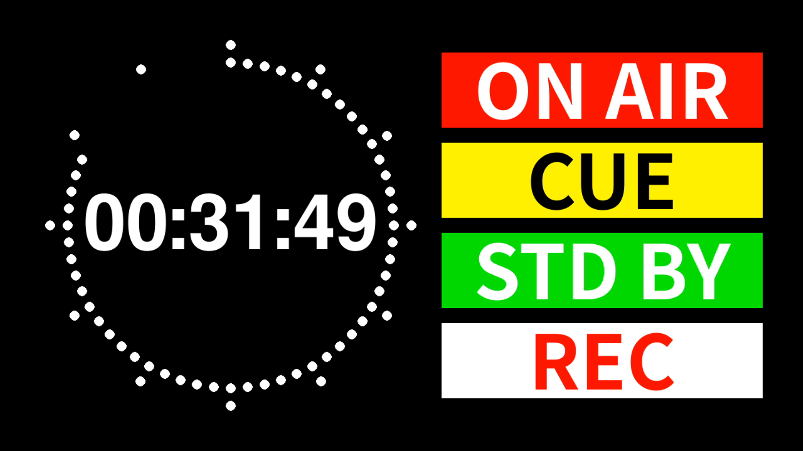
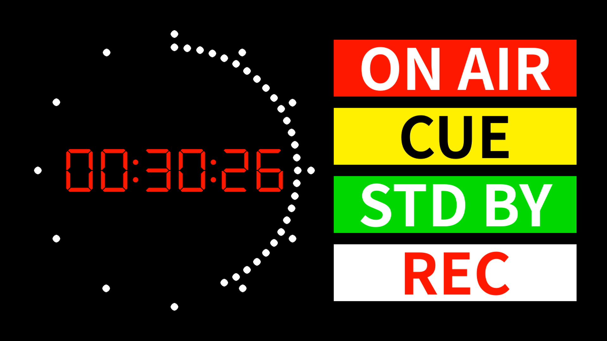

# PiRSClock-Full (Modified)

Raspberry Pi Radio Studio Clock with configurable studio indicators, forked from [jdgwarren/pirsclockfull](https://github.com/jdgwarren/pirsclockfull).

Originally created by Peter Symonds.

## Screenshots

| System Default Font | DSEG7 Custom Font |
|:---:|:---:|
|  |  |

## Changes from Original

- External configuration file (`config.txt`) for indicator labels, colors, and clock colors
- Auto-reload of configuration (detects file changes every 5 seconds)
- IP address display toggle (press `A` key)
- Font toggle between system default and custom fonts (press `F` key)
- Custom font support with fallback to system default when font files are not present
- Keyboard-based indicator control (keys `1`-`4`) in addition to GPIO
- Quit with `Q` key

## Hardware Requirements

Raspberry Pi with GPIO header. Pins 11, 12, 13, and 15 light up the corresponding indicators when connected to Ground (pin 6).

More info: [Raspberry Pi GPIO](https://www.raspberrypi.com/documentation/computers/raspberry-pi.html)

**EXERCISE CAUTION WHEN HANDLING ELECTRICITY**

## Installation

### Prerequisites

- Raspberry Pi OS (Bookworm or later recommended)
- Python 3
- pygame

```bash
sudo apt-get update
sudo apt-get install python3-pygame
```

### Setup

1. Clone this repository:

```bash
git clone https://github.com/stcatcom/pirsclockfull.git
cd pirsclockfull
```

2. Run:

```bash
python3 pirsclockfull.py
```

### Auto-start on boot

Create a systemd service or add to crontab:

```bash
crontab -e
```

Add:

```
@reboot /usr/bin/python3 /path/to/pirsclockfull.py &
```

## Configuration

Edit `config.txt` in the same directory as the script.

### Format

```
<Label>,<TextR>,<TextG>,<TextB>,<BgR>,<BgG>,<BgB>    # Indicator 1
<Label>,<TextR>,<TextG>,<TextB>,<BgR>,<BgG>,<BgB>    # Indicator 2
<Label>,<TextR>,<TextG>,<TextB>,<BgR>,<BgG>,<BgB>    # Indicator 3
<Label>,<TextR>,<TextG>,<TextB>,<BgR>,<BgG>,<BgB>    # Indicator 4
<ClockR>,<ClockG>,<ClockB>,<DotR>,<DotG>,<DotB>      # Clock colors
```

### Example (`config.txt`)

```
ON AIR,255,255,255,255,0,0
CUE,0,0,0,255,255,0
STD BY,255,255,255,0,255,0
REC,255,0,0,255,255,255
255,0,0,255,255,255
```

- Lines 1-4: Indicator label, text color (RGB), background color (RGB)
- Line 5: Digital clock color (RGB), dot marker color (RGB)

Changes to `config.txt` are automatically detected and applied without restarting.

## Keyboard Controls

| Key | Action |
|-----|--------|
| `Q` | Quit |
| `F` | Toggle font (system default / custom) |
| `A` | Toggle IP address display |
| `R` | Manual configuration reload |
| `1`-`4` | Activate indicators (momentary) |

## Custom Fonts (Recommended)

This program works without any custom fonts (system default font is used). For a more authentic studio clock appearance, the following fonts are recommended:

**Note:** The system default font only supports ASCII characters. To display multibyte characters such as Japanese in indicator labels, a compatible font (e.g., GenShinGothic) is required.

| Font | Usage | Download |
|------|-------|----------|
| DSEG7Classic-Regular.ttf | Clock display | [DSEG Font Family](https://github.com/keshikan/DSEG) (SIL OFL 1.1) |
| GenShinGothic-P-Bold.ttf | Indicator labels | [GenShinGothic](http://jikasei.me/font/genshin/) (SIL OFL 1.1) |

```
pirsclockfull/
├── pirsclockfull.py
├── config.txt
└── Fonts/
    ├── DSEG7Classic-Regular.ttf
    └── GenShinGothic-P-Bold.ttf
```

Press `F` to toggle between system default and custom fonts (clock display only).

## Support

If you find this project useful, consider supporting development:

[](https://paypal.me/stcatcom?locale.x=ja_JP&country.x=JP)

## License

GNU General Public License v3.0 - see [LICENSE](LICENSE) for details.

Original work Copyright (C) 2014 Peter Symonds
Modified work Copyright (C) 2026 Masaya Miyazaki (stcatcom)
